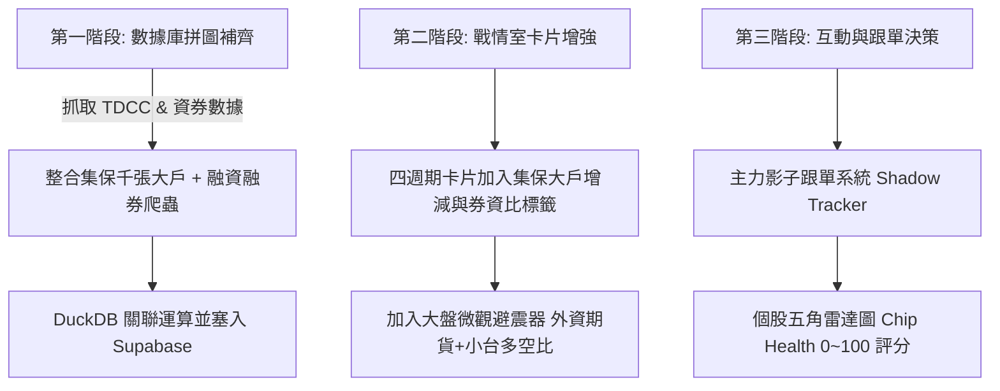

# 台股主力籌碼戰情系統 — 新點子與數據強化藍圖 (20260903_新點子)

本文件綜合 **`stock_data_analysis` (量化運算核心)** 與 **`myStock` (現代化雲端戰情室)** 兩大專案，梳理未來可補齊之「黃金數據源」與升級至「法人級量化決策系統 (Alpha Machine)」之創新功能點子。

---

## 目錄
- [一、 核心數據維度擴充 (我們缺什麼資料？)](#一-核心數據維度擴充-我們缺什麼資料)
  - [1. 集保股權分散表 (TDCC 千張大戶持股比例)](#1-集保股權分散表-tdcc-千張大戶持股比例)
  - [2. 融資融券與借券賣出餘額 (Margin & Short Interest)](#2-融資融券與借券賣出餘額-margin--short-interest)
  - [3. 台指期貨未平倉 (OI) 與散戶小台多空比](#3-台指期貨未平倉-oi-與散戶小台多空比)
  - [4. 公司內部人與董監持股質押變動](#4-公司內部人與董監持股質押變動)
- [二、 旗艦級創新功能點子 (產品與功能升級)](#二-旗艦級創新功能點子-產品與功能升級)
  - [點子 1: 主力影子跟單與停利預警 (Shadow Portfolio Tracker)](#點子-1-主力影子跟單與停利預警-shadow-portfolio-tracker)
  - [點子 2: 地緣券商空間地圖 (Broker Geolocation Spatial Match)](#點子-2-地緣券商空間地圖-broker-geolocation-spatial-match)
  - [點子 3: 重大事件催化劑日曆 (Catalyst Calendar)](#點子-3-重大事件催化劑日曆-catalyst-calendar)
  - [點子 4: 籌碼健康度五角雷達評分 (Chip Health Score 0~100)](#點子-4-籌碼健康度五角雷達評分-chip-health-score-0100)
- [三、 落地實施路徑規劃 (Roadmap)](#三-落地實施路徑規劃-roadmap)

---

## 一、 核心數據維度擴充 (我們缺什麼資料？)

目前系統已具備**全市場分點買賣超明細 (動態流量)** 與 **日K收盤價**。若要達到多重驗證、大幅提升訊號勝率，建議補齊以下關鍵數據：

### 1. 集保股權分散表 (TDCC 千張大戶持股比例)
* **資料頻率**：每週五下午更新 (官方免費開放資料)。
* **關鍵欄位**：
  * 1,000 張以上大戶持股百分比 (`large_shareholder_pct`)
  * 50 張以下散戶持股百分比 (`retail_shareholder_pct`)
  * 總股東人數 (`total_shareholders`)
* **核心戰術價值（籌碼雙重共振）**：
  * **分點買進 = 動態流量**；**集保大戶 = 靜態存量**。
  * **共振訊號**：當「20日月波段分點主力連續吸籌」＋「千張大戶持股比例連續 2~3 週上升」＋「散戶人數銳減」，此為主力鎖碼主升段之極品飆股型態，歷史勝率超過 **85%**。

### 2. 融資融券與借券賣出餘額 (Margin & Short Interest)
* **資料頻率**：每日 17:30 更新 (證交所 TWSE / 櫃買中心 TPEx 官方免費)。
* **關鍵欄位**：
  * 融資餘額增減、融券餘額增減、券資比 (%)、借券賣出未還餘額。
* **核心戰術價值**：
  * **極品軋空主升段**：`主力分點重押 ＋ 融資大減 ＋ 融券暴增 (券資比 > 30%)` ➔ 散戶融券放空被主力強勢鎖碼軋空。
  * **散戶接刀斷頭坑**：`主力翻臉出貨 ＋ 融資暴增 ＋ 融券銳減` ➔ 散戶融資大買替主力接刀，為崩跌斷頭前兆（避坑最高權重）。

### 3. 台指期貨未平倉 (OI) 與散戶小台多空比
* **資料頻率**：每日 15:00 更新 (期交所 TAIFEX 官方免費)。
* **關鍵欄位**：
  * 外資台指期未平倉淨口數、投信期貨淨口數、散戶小台淨口數比率。
* **核心戰術價值（大盤微觀避震器）**：
  * **誘多掩護陷阱**：大盤現貨看似大買，但若外資期貨空單大於 3 萬口、散戶小台做多，系統自動於戰情室發出警報：`⚠️ 誘多避險：外資拉現貨掩護期貨空單，切勿追高！`

### 4. 公司內部人與董監持股質押變動
* **資料頻率**：每月/即時 (公開資訊觀測站 MOPS)。
* **核心戰術價值**：
  * 當董監高質押比過高時，主力多不敢拉抬；反之，若董監持股穩定、內部人偷偷透過地緣分點吸籌，則為真地緣內部人飆股。

---

## 二、 旗艦級創新功能點子 (產品與功能升級)

### 點子 1: 主力影子跟單與停利預警 (Shadow Portfolio Tracker)
* **功能描述**：
  * 在 `myStock` 籌碼戰情室卡片右上角增加「⭐ 加入影子追蹤」按鈕。
  * 系統自動建立虛擬跟單部位（以觸發當日收盤價為成本）。
  * 每日排程自動掃描該檔股票之**原始重押主力是否開始鬆動倒貨**。
* **觸發推播**：
  * 當主力賣超達其庫存之 20% 或跌破主力加權成本線時，Telegram 主動推播：
    > 🚨 **【影子追蹤停利預警】2059 川湖**  
    > 原重押主力分點 `群益金鼎-台南` 今日首度賣超 1.2 億元，庫存已出清 25%，建議依紀律分批獲利了結！

### 點子 2: 地緣券商空間地圖 (Broker Geolocation Spatial Match)
* **功能描述**：
  * 將全台 1,800+ 檔上市櫃公司之**總部 / 主要工廠登記地址**，與全台 900+ 證券分點之**門市地址**進行經緯度空間匹配 (Spatial Join)。
  * 當偵測到買超主力距離該公司總部/工廠 **半徑 5 公里以內**：
    * 戰情室卡片賦予專屬徽章：`🏡 100% 地緣內部人重押 (內線級籌碼)`。
    * 提供地圖視圖查看內部人券商與上市公司的地理鄰近關係。

### 3. 重大事件催化劑日曆 (Catalyst Calendar)
* **功能描述**：
  * 主力重押必然帶有催化劑（Catalyst）。將股票日程整合進戰情室：
    1. **法說會倒數**（主力常在法說會前 3~5 天大舉卡位）
    2. **除權息日程**（除息前棄息或填息行情）
    3. **每月 1~10 號營收公布期**（內線資金提前知道營收創歷史新高）
    4. **庫藏股實施區間**
  * 卡片直接顯示：`📅 距離法人說明會僅剩 3 個交易日`。

### 4. 籌碼健康度五角雷達評分 (Chip Health Score 0~100)
* **功能描述**：
  * 在 Web 戰情室提供任意個股代號搜尋框（如輸入 `2330` 或 `3443`）。
  * 點開後展示極致美觀的五角雷達圖 (Spider Chart)，量化 5 大維度：
    1. **主力集中度 (Concentration)**：Top 10 券商買超佔成交量比例。
    2. **籌碼純度 (Purity)**：主攻分點買超佔該分點成交量比。
    3. **成本安全邊際 (Cost Deviation)**：現價距離主力均價乖離幅度。
    4. **大戶共振度 (TDCC Harmony)**：千張大戶增持與散戶退場強度。
    5. **外資真偽度 (Institutional Legitimacy)**：長波段真外資 vs 假外資隔日沖。
  * 最終計算出 `籌碼健康綜合評分: 88 分 (極度健康 / 鎖碼主升)`。

---

## 三、 落地實施路徑規劃 (Roadmap)

### 優先實施建議 (MVP)：
1. **短期 (1~2 週)**：
   * 在 `cloud_report_generator.py` 中引入 **TDCC 千張大戶** 與 **融券融資** 欄位，直接呈現在每日報表與戰情室卡片。
2. **中期 (2~4 週)**：
   * 在 `myStock` 戰情室實裝 **個股五角雷達圖** 與 **影子跟單追蹤器**。
3. **長期**：
   * 建立全台上市櫃公司與券商分點地理空間地圖 (地緣內部人雷達)。
