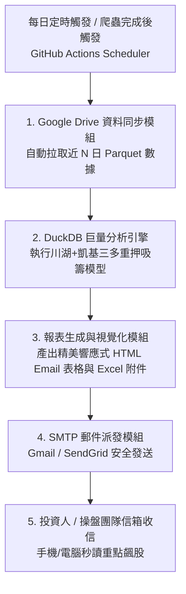

# 雲端自動化「川湖+凱基三多重押模型」日報系統規劃書

---

## 1. 系統架構與業務流程

本系統旨在結合現有 **Google Drive 雲端分點數據庫** 與 **DuckDB 核心分析引擎 (`find_similar_cases.py`)**，透過 **GitHub Actions** 實現每日收盤後的無伺服器（Serverless）全自動化量化掃描與 Email 決策日報派送。



---

## 2. 核心模組規劃

### 模組 1：Google Drive 智慧增量拉取 (`cloud_gdrive_sync.py`)
* **功能**：從 Google Drive 目標資料夾中，精準檢索並下載分析所需的近 $N$ 個交易日（如 5 日、10 日、20 日）全市場 Parquet 檔案。
* **認證方式**：採用 Google Cloud 服務帳戶金鑰 (`GDRIVE_SERVICE_ACCOUNT_KEY`，存放於 GitHub Secrets)。
* **快取優化**：僅下載必要天數的 Parquet 檔案至 Action 執行環境之臨時目錄，分析完畢自動清理，節省頻寬與時間。

---

### 模組 2：量化重押模型計算 (`run_cloud_analysis.py`)
* **核心依據**：繼承與延伸 `find_similar_cases.py` 之「川湖 (2059) + 凱基-三多 (9275)」模型。
* **篩選門檻與多週期雷達**：
  1. **短線爆發型（近 3~5 日）**：主力佔個股成交量比重 $\ge 15\%$，淨買超金額 $\ge 3,000$ 萬元。
  2. **波段重押型（近 10~20 日）**：連續買超天數比重高、主力累計重押佔比大、淨買超金額 $\ge 1$ 億元。
  3. **分點買均價與現價乖離監控**：標註主力成本區間。
* **輸出格式**：結構化 JSON / DataFrame 資料集，供 HTML 模板渲染。

---

### 模組 3：響應式 HTML 郵件模板設計 (`report_template.html`)
* **設計風格**：採用現代金融科技（FinTech）深色/簡約高質感風格，支援手機與電腦版自適應排版。
* **重點區塊**：
  1. **📊 今日盤勢與主力吸籌摘要指標**（監控股票總數、今日重押分點總數、最大買超金額標的）。
  2. **🔥 核心 TOP 重押飆股雷達表格**：
     - 包含欄位：`股票代號/名稱`、`主力券商分點`、`分析區間`、`波段淨買超(張)`、`佔個股成交量比重(%)`、`主力波段淨買金額(億/千萬)`、`主力買進均價`、`最新收盤價`、`成本偏離度`。
  3. **📈 重點個股主力吸籌特徵標籤**（如：`連續買超`、`單一分點獨大`、`低檔佈局`）。
  4. **📎 附加檔案**：自動夾帶當日完整篩選清單 Excel (`.xlsx`) 供深度複盤。

---

### 模組 4：GitHub Actions 雲端排程 (`.github/workflows/daily_heavy_accumulation_report.yml`)
* **觸發時機**：
  1. **自動排程**：每日 18:30（台灣時間，確保交易所與 Google Drive 資料已就緒）。
  2. **工作流聯動 (`workflow_run`)**：在 `daily_stock_crawler.yml` 成功完成後自動銜接執行。
  3. **手動觸發 (`workflow_dispatch`)**：支援自訂分析天數、門檻參數與測試收件人。

---

## 3. HTML 郵件視覺版面示意 (UI Wireframe)

```html
+-----------------------------------------------------------------------+
|  🚀 台灣股市主力波段連續重押吸籌雷達日報 (川湖+凱基三多模型)           |
|  📅 分析日期：2026-08-26  |  資料天期：近 5 交易日  |  全市場掃描完成 |
+-----------------------------------------------------------------------+
|  【今日重點摘要】                                                     |
|  - 符合重押標準個股：12 檔                                            |
|  - 最大單一主力買超：2059 川湖 (凱基-三多 累計買超 4.8 億，佔比 22.4%) |
+-----------------------------------------------------------------------+
|  【🔥 核心主力重押清單 TOP 排行】                                     |
|  +--------+----------+------------+----------+--------+-------------+ |
|  | 股票   | 重押分點 | 淨買超(張) | 佔比(%)  | 買均價 | 累計金額    | |
|  +--------+----------+------------+----------+--------+-------------+ |
|  | 2059川湖| 9275凱基三多|   +450 張  |  22.4%   | 1,050  | 4.82 億 (首位)|
|  | 3017奇鋐| 1470台灣摩根| +1,280 張  |  16.8%   |   580  | 7.42 億     | |
|  +--------+----------+------------+----------+--------+-------------+ |
|  💡 提示：詳細標的明細與分點進出明細請查閱郵件隨附之 Excel 報表。      |
+-----------------------------------------------------------------------+
```

---

## 4. 所需環境變數與 GitHub Secrets 清單 (完全相容 stock_data_downloader)

| 變數名稱 | 類型 | 說明與用途 | 範例值 |
| :--- | :---: | :--- | :--- |
| `GDRIVE_UPLOAD_URL` | Secret / Var | Google Apps Script Web App 雲端橋接 URL | `https://script.google.com/macros/s/.../exec` |
| `GDRIVE_FOLDER_ID` | Secret / Var | 存放 Parquet 分點日資料的 Google Drive 資料夾 ID | `your_google_drive_folder_id` |
| `GDRIVE_LOG_FOLDER_ID` | Secret / Var | 存放 Log / 報表的 Google Drive 資料夾 ID | `your_google_drive_log_folder_id` |
| `GDRIVE_SERVICE_ACCOUNT_KEY` | Secret | Google Cloud 服務帳號 JSON 金鑰（備援直連） | `{"type": "service_account", ...}` |
| `TELEGRAM_BOT_TOKEN` | Secret | Telegram Bot Token (即時簡報推播) | `your_telegram_bot_token` |
| `TELEGRAM_CHAT_ID` | Secret | Telegram Chat ID | `your_telegram_chat_id` |
| `SMTP_SERVER` | Secret / Var | SMTP 伺服器位置 | `smtp.gmail.com` |
| `SMTP_PORT` | Secret / Var | SMTP 埠號 (STARTTLS 預設 587 / SSL 465) | `587` |
| `SMTP_USER` | Secret | 發信帳號 (Gmail 地址) | `your_email@gmail.com` |
| `SMTP_PASSWORD` | Secret | 發信應用程式專用密碼 (App Password) | `your_gmail_app_password` |
| `RECEIVER_EMAIL` | Secret / Var | 收件人清單（支援多個 Email，逗號分隔） | `your_email@gmail.com` |

---

## 5. 實作計畫里程碑 (Roadmap)

1. **階段一：雲端資料拉取與分析管線封裝**
   - 撰寫 GDrive 下載與 DuckDB 模型對接腳本 (`cloud_daily_scanner.py`)。
2. **階段二：HTML 郵件模板與發信模組開發**
   - 設計響應式 HTML 樣板與 Python SMTP 寄送邏輯。
3. **階段三：GitHub Actions 自動化工作流佈署**
   - 建立 `.github/workflows/daily_heavy_accumulation_report.yml` 並完成測試。
4. **階段四：手冊更新與驗收**
   - 更新專案操作手冊 (`操作手冊.md`) 並交付使用。
