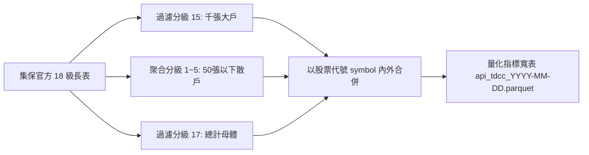
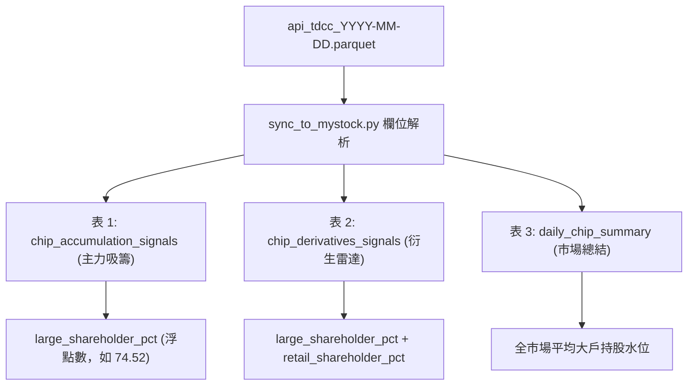

# 股權分散表在各項量化分析中的計算方法與整合指南 (教學手冊)

本教學手冊專為量化工程師與投資決策者編寫，詳細剖析本專案中**臺灣集中保管結算所（TDCC）股權分散表**的底層數學模型、特徵萃取演算法，以及它如何全面融入「主力吸籌、出貨識別、資券軋空、散戶套牢、戰情室儀表板」等各項核心量化分析維度。

---

## 📌 目錄 (Table of Contents)
1. [集保股權分散表 (TDCC) 原始架構與特徵清洗](#1-集保股權分散表-tdcc-原始架構與特徵清洗)
2. [分析項目 ①：主力波段連續重押吸籌模型 (川湖/三多模型) 與大戶共振](#2-分析項目--主力波段連續重押吸籌模型-川湖三多模型-與大戶共振)
3. [分析項目 ②：大戶散戶動態消長與籌碼背離矩陣 (週增減差分模型)](#3-分析項目--大戶散戶動態消長與籌碼背離矩陣-週增減差分模型)
4. [分析項目 ③：買賣家數差 (微觀籌碼) 與千張大戶 (宏觀籌碼) 雙重驗證](#4-分析項目--買賣家數差-微觀籌碼-與千張大戶-宏觀籌碼-雙重驗證)
5. [分析項目 ④：極品資券軋空雷達 (Squeeze Radar) 結合流通浮額鎖碼](#5-分析項目--極品資券軋空雷達-squeeze-radar-結合流通浮額鎖碼)
6. [分析項目 ⑤：散戶接刀套牢坑 (Retail Trap Radar) 與籌碼發散判定](#6-分析項目--散戶接刀套牢坑-retail-trap-radar-與籌碼發散判定)
7. [分析項目 ⑥：myStock 戰情室儀表板指標封裝與資料庫同步 (Supabase)](#7-分析項目--mystock-戰情室儀表板指標封裝與資料庫同步-supabase)
8. [實戰指標綜合檢驗查核清單 (Cheat Sheet)](#8-實戰指標綜合檢驗查核清單-cheat-sheet)
9. [關鍵技術思維辨析：週線靜態底牌 vs 每日即時累加機制 (Deep Dive)](#9-關鍵技術思維辨析週線靜態底牌-vs-每日即時累加機制-deep-dive)
   - [9.1 每天日報表的大戶是上週統計數，如何得知每日實際進出？](#91-每天日報表的大戶是上週統計數如何得知每日實際進出)
   - [9.2 能否拿「上週集保 + 本週分點」來還原或驗算本週集保？](#92-能否拿上週集保--本週分點來還原或驗算本週集保)
   - [9.3 本週六公布的集保只是為了下週計算用嗎？](#93-本週六公布的集保只是為了下週計算用嗎)
   - [9.4 平日沒把每日買賣累加到大戶比例，會不會隨時間失真？](#94-平日沒把每日買賣累加到大戶比例會不會隨時間失真)
   - [9.5 具體由哪幾隻程式負責「天天即時累加」？](#95-具體由哪幾隻程式負責天天即時累加)

---

## 1. 集保股權分散表 (TDCC) 原始架構與特徵清洗

### 1.1 官方 18 個持股分級定義
臺灣集中保管結算所（TDCC）每週統計一次全市場上市櫃公司之股東持股分級，原始資料採用 **長表結構 (Long Format)**，共定義 18 個持股分級（級距代碼 1 ～ 17）：

| 持股分級代碼 | 持股級距 (股數) | 實務金融代表性 | 量化歸類 |
| :---: | :--- | :--- | :---: |
| **1** | 1 ～ 999 股 | 零股交易者 | **散戶群 (Retail)** |
| **2** | 1,000 ～ 5,000 股 | 1 ～ 5 張小資族 | **散戶群 (Retail)** |
| **3** | 5,001 ～ 10,000 股 | 5 ～ 10 張一般散戶 | **散戶群 (Retail)** |
| **4** | 10,001 ～ 15,000 股 | 10 ～ 15 張一般投資人 | **散戶群 (Retail)** |
| **5** | 15,001 ～ 50,000 股 | 15 ～ 50 張中實戶邊緣 | **散戶群 (Retail)** |
| 6 ～ 14 | 50,001 ～ 1,000,000 股 | 50 ～ 1,000 張中實戶與區域主力 | 中實戶浮額 |
| **15** | **1,000,001 股以上** | **1,000 張以上千張大戶 (含董監、外資、投信、長線家族基金)** | **超級大戶 (Large)** |
| **16** | 特殊保留級距 | 依集保官方定義 | 備用 |
| **17** | **合計 (Total)** | **全公司總股東人數與總發行集保股數** | **全體母體 (Total)** |

### 1.2 向量化特徵提取與寬表聚合演算法
在 [`tdcc_shareholding_crawler.py`](file:///d:/MyProject/stock_data_downloader/tdcc_shareholding_crawler.py) 中，我們透過向量化運算將千萬列的長表聚合為每檔個股單一列的**量化指標寬表**：



#### 核心計算公式：
1. **千張大戶持股比例 (%)**：
   $$\text{LargeShareholderPct} = \text{ratio\_pct}_{\text{level}=15}$$
   *(直接提取持股分級 15 之占集保庫存數比例，精確至小數點後兩位)*
2. **50張以下散戶持股比例 (%)**：
   $$\text{RetailShareholderPct} = \sum_{i=1}^{5} \text{ratio\_pct}_{\text{level}=i}$$
   *(累計分級 1 到 5 之持股比例，代表市場散戶未成熟籌碼之總和)*
3. **50張以下散戶股東總人數**：
   $$\text{RetailShareholderCount} = \sum_{i=1}^{5} \text{people}_{\text{level}=i}$$
4. **全公司總股東人數**：
   $$\text{TotalShareholders} = \text{people}_{\text{level}=17}$$

---

## 2. 分析項目 ①：主力波段連續重押吸籌模型 (川湖/三多模型) 與大戶共振

在量化分點分析中，「主力分點」是在券商據點連續買進的資金；但主力究竟是「真波段大戶」還是「假買真避稅/借券戶」？必須透過集保千張大戶進行**真偽驗證（Resonance Verification）**。

### 2.1 主力分點與集保大戶的交叉比對邏輯
在 [`sync_to_mystock.py`](file:///d:/MyProject/stock_data_analysis/sync_to_mystock.py) 與 [`chip_derivatives_engine.py`](file:///d:/MyProject/stock_data_analysis/chip_derivatives_engine.py) 中：
1. 先由 DuckDB 跑出四週期（5日、10日、20日、60日）主力重押排行榜：
   - 買進純度 $\ge 75\%$
   - 淨買超金額 $\ge 0.5$ 億元（川湖模型標準）
   - 連續買超天數比重 $> 70\%$
2. 將運算結果以股票代號 `symbol` 關聯當週集保之 `large_shareholder_pct`。

### 2.2 大戶鎖碼強度評級矩陣 (Lockup Rating)
系統根據千張大戶持股比例，自動將主力重押標的標註三種籌碼穩定度等級：

$$\text{LockupGrade} = \begin{cases} 
\text{👑 超高鎖碼 (> 70\%)}, & \text{若 } \text{large\_shareholder\_pct} \ge 70.0\% \\
\text{🔒 穩健鎖碼 (50\% ~ 70\%)}, & \text{若 } 50.0\% \le \text{large\_shareholder\_pct} < 70.0\% \\
\text{⚠️ 籌碼凌亂 (< 50\%)}, & \text{若 } \text{large\_shareholder\_pct} < 50.0\%
\end{cases}$$

#### 💡 教學解讀原則：
- **為什麼 70% 是黃金分水嶺？**
  - 當千張大戶持股超過 70%，代表在外流通的浮動籌碼（Free Float）不超過 30%。此時主力分點只要投入數億元，就能引發股價供需失衡、連續推升漲停，如典型的 **2059 川湖**、**3653 健策** 飆股模型。
- **若大戶持股 < 50% 即使主力買超意味著什麼？**
  - 代表市場籌碼高度散落於散戶與短線當沖客手中，主力分點推升阻力大，常出現「爆量長黑」或「開高走低」，作戰應採短線當沖/隔日沖思維，不可輕易長抱。

---

## 3. 分析項目 ②：大戶散戶動態消長與籌碼背離矩陣 (週增減差分模型)

靜態的持股比例只能看底牌，**「週增減動態趨勢」**才是發動攻擊的起點。

### 3.1 週次一階差分計算公式
系統提取當週基準週五 ($t$) 與前一週基準週五 ($t-1$) 之數據：

$$\Delta \text{Large} = \text{large\_shareholder\_pct}_t - \text{large\_shareholder\_pct}_{t-1}$$

$$\Delta \text{Retail} = \text{retail\_shareholder\_pct}_t - \text{retail\_shareholder\_pct}_{t-1}$$

$$\Delta \text{ShareholdersCount} = \text{total\_shareholders}_t - \text{total\_shareholders}_{t-1}$$

### 3.2 籌碼四象限背離判定模型 (Divergence Model)

```text
               ▲ 大戶持股週增減 (ΔLarge)
               │
      [象限 II] │     [象限 I] ⭐ 極品鎖碼飆股
   大戶大買/散戶也買 │  【大戶大買 + 散戶大退】 (ΔLarge > 0 且 ΔRetail < 0)
 (市場全面過熱追價)│  籌碼由散戶集中至董監外資手中，籌碼極致沉澱！
───────────────┼────────────────────────► 散戶持股週增減 (ΔRetail)
      [象限 III]│     [象限 IV] ⚠️ 惡性出貨接刀
   大戶小賣/散戶小退 │  【大戶大倒 + 散戶大接】 (ΔLarge < 0 且 ΔRetail > 0)
 (低檔量縮無人問津)│  大戶高檔倒貨，散戶融資接刀，套牢風險極高！
               │
```

#### 系統自動警示標籤規則：
1. **`🔥 大戶吸籌散戶退 (黃金型態)`**：
   - 判定條件：$\Delta \text{Large} \ge +0.5\%$ 且 $\Delta \text{Retail} \le -0.5\%$
   - 意涵：千張大戶單週大增超過 0.5%，同時 50 張以下散戶退場超過 0.5%，代表籌碼完成大換手，即將進入主升段。
2. **`⚠️ 假拉抬真出貨警報`**：
   - 判定條件：分點買超排行居前，但 $\Delta \text{Large} \le -1.0\%$
   - 意涵：主力券商分點雖有買單，但整體千張大戶卻大幅拋售超過 1%，高機率為「對倒左手換右手」掩護特定大股東下車。

---

## 4. 分析項目 ③：買賣家數差 (微觀籌碼) 與千張大戶 (宏觀籌碼) 雙重驗證

在量化交易中，單一日的分點買賣家數差容易受到單日偶發大單干擾，結合每週集保大戶能達到「日線微觀」與「週線宏觀」的互鎖驗證。

### 4.1 買賣家數差定義 (Broker Divergence)
在 [`chip_derivatives_engine.py`](file:///d:/MyProject/stock_data_analysis/chip_derivatives_engine.py#L200-L215) 中：
$$\text{BrokerDiff} = \text{Count}(\text{有買進之券商分點}) - \text{Count}(\text{有賣出之券商分點})$$

- **$\text{BrokerDiff} < 0$ (負值越大越好)**：代表極少數的買方分點，吃下極多數賣方分點拋出的籌碼，籌碼高度集中。
- **$\text{BrokerDiff} > 0$ (正值越大越危險)**：代表少數賣方大單，倒給市場上百家買方散戶分點，籌碼嚴重發散。

### 4.2 雙重共振演算法 (Dual Resonance)
系統在每日產出的衍生戰報中，將兩者進行交集篩選：

```python
# 核心條件：單日微觀集中 (BrokerDiff < -15) 且 宏觀千張大戶重度鎖碼 (large_shareholder_pct >= 65%)
is_dual_resonance = (row["broker_diff"] <= -15) and (row["large_shareholder_pct"] >= 65.0)
```

- **戰略意義**：
  - 若僅有 $\text{BrokerDiff} < 0$，可能是隔日沖短線客進駐。
  - 若**同時具備千張大戶持股 $\ge 65\%$**，證實該股長線底倉已被大戶鎖死，今日的買方分點極可能是長線同盟軍發動攻勢的訊號。

---

## 5. 分析項目 ④：極品資券軋空雷達 (Squeeze Radar) 結合流通浮額鎖碼

信用交易（融資融券）是散戶與短線投機客最活躍的場所。但只有在**「現貨籌碼被大戶收乾」**的前提下，高券資比才會形成毀滅性的軋空暴漲。

### 5.1 軋空倍數與流通股數計算
1. **券資比 (Short-to-Margin Ratio %)**：
   $$\text{ShortMarginRatio} = \frac{\text{融券餘額 (張)}}{\text{融資餘額 (張)}} \times 100\%$$
2. **市場自由流通張數 (Free Float Shares)**：
   $$\text{FreeFloatShares} = \text{TotalShares} \times (100\% - \text{large\_shareholder\_pct})$$

### 5.2 極品軋空複合指標模型 (Super Squeeze Model)
在系統中，一檔股票被評定為 `🚀 極品軋空候選` 必須同時通過四重門檻：

$$\text{SuperSqueeze} = \begin{cases}
\text{True}, & \text{若 } \begin{cases} 
\text{short\_margin\_ratio\_pct} \ge 20.0\% & \text{(高券資比)} \\
\text{short\_net} \ge 50 \text{ 張} & \text{(空頭單日持續加碼)} \\
\text{broker\_diff} < 0 & \text{(買賣家數差集中)} \\
\textbf{large\_shareholder\_pct} \ge \textbf{65.0\%} & \textbf{(大戶高位鎖碼，流通現貨稀缺)} 
\end{cases} \\
\text{False}, & \text{其他}
\end{cases}$$

#### 💡 實戰教學意涵：
- 若一檔股票券資比高達 40%，但千張大戶持股只有 30%（散戶股），通常只是多空分歧的混戰，主力很容易反手倒貨引發「殺多」。
- 但若 **千張大戶持股高達 70%**，在外流通現貨僅剩 30%，融券空頭回補時在市場上根本買不到足額現貨，被迫以漲停價市價掛進，形成連環軋空！

---

## 6. 分析項目 ⑤：散戶接刀套牢坑 (Retail Trap Radar) 與籌碼發散判定

與軋空相反，主力出貨最常用的手法是「融資掩護現貨出貨」。

### 6.1 散戶接刀指標模型 (Retail Trap Model)
系統透過以下三維條件偵測高危險接盤訊號：

$$\text{RetailTrap} = \begin{cases}
\text{True}, & \text{若 } \begin{cases} 
\text{margin\_net} \ge 150 \text{ 張} & \text{(散戶融資單日暴增)} \\
\text{broker\_diff} > 20 & \text{(買賣家數差大幅擴散，籌碼混亂)} \\
\textbf{retail\_shareholder\_pct} \ge \textbf{30.0\%} & \textbf{(散戶持股比例居高不下或單週暴增)} 
\end{cases} \\
\text{False}, & \text{其他}
\end{cases}$$

#### 警示指引：
系統在資料庫與戰情室自動賦予標籤：
- **標籤**：`🩸 散戶接刀套牢坑`
- **作戰指引**：`融資大增且家數差極度發散，散戶盲目追價接刀，主力悄悄撤退，嚴禁持股續抱，宜反彈停損！`

---

## 7. 分析項目 ⑥：myStock 戰情室儀表板指標封裝與資料庫同步 (Supabase)

量化運算的終點在於**決策呈現**。在 [`sync_to_mystock.py`](file:///d:/MyProject/stock_data_analysis/sync_to_mystock.py) 中，股權分散表被解構並分流注入 Supabase 關聯資料庫：

### 7.1 Supabase 資料庫欄位注入規格



### 7.2 前端 JavaScript 視覺化渲染邏輯 (myStock App)
在儀表板前端 [`app.js`](file:///d:/MyProject/myStock/app.js) 中，大戶數據會自動轉換為徽章與篩選器：

1. **大戶持股徽章 (Badges)**：
   - `large_pct >= 70%` ➔ 渲染為金黃色霓虹徽章 **`👑 大戶鎖碼 74.5%`**
   - `large_pct >= 50%` ➔ 渲染為冰藍色穩健徽章 **`🔒 大戶 58.2%`**
   - `large_pct < 50%` ➔ 渲染為次要淡灰色徽章 **`散 42.1%`**
2. **衍生指標雷達子分頁過濾 (Tabs)**：
   - 點擊「**大戶增持榜**」：前端自動過濾 `signal_type == 'concentrated'`，並依 `large_shareholder_pct` 由高到低排序，直接呈現全市場前 20 檔大戶籌碼最乾淨的主力黑馬股！

---

## 8. 實戰指標綜合檢驗查核清單 (Cheat Sheet)

為了方便盤後複盤與選股決策，以下將集保股權分散表在各項分析中的黃金檢驗標準整理為清單：

| 分析維度 | 檢驗指標 | 完美多頭 (強烈做多) | 危險空頭 (強烈避險/放空) |
| :--- | :--- | :---: | :---: |
| **底倉結構** | 千張大戶持股比例 (`large_shareholder_pct`) | **$\ge 70\%$ (超高鎖碼)** | $< 40\%$ (籌碼極度渙散) |
| **散戶籌碼** | 50張以下散戶比例 (`retail_shareholder_pct`) | **$\le 15\%$ (散戶稀少)** | $\ge 40\%$ (散戶集中營) |
| **動態趨勢** | 大戶持股週增減 ($\Delta \text{Large}$) | **$> +0.8\%$ (單週暴力吸籌)** | $< -1.0\%$ (大戶集體跳船) |
| **籌碼背離** | 大戶增減 vs 散戶增減 | **大戶增、散戶減 ($\Delta \text{L} > 0, \Delta \text{R} < 0$)** | 大戶減、散戶增 ($\Delta \text{L} < 0, \Delta \text{R} > 0$) |
| **微觀共振** | 買賣家數差 (`broker_diff`) | **大幅負值 ($< -20$)** | 大幅正值 ($> +25$) |
| **融資動向** | 融資單日淨買超 (`margin_net`) | 融資平穩或減少 (現貨實力買進) | **融資暴增且家數差發散 (散戶接刀)** |
| **資券軋空** | 券資比 + 千張大戶鎖碼 | **券資比 $> 25\%$ 且 大戶 $> 65\%$** | 券資比高但大戶持股低 (容易殺多) |
| **波段持續性** | 20日主力重押純度 | **$\ge 75\%$ 且 買超金額 $> 1$ 億** | 買進純度低於 50% (當沖洗量) |

---


---

## 9. 關鍵技術思維辨析：週線靜態底牌 vs 每日即時累加機制 (Deep Dive)

### 9.1 每天日報表的大戶是上週統計數，如何得知每日實際進出？

許多初學者常有疑問：「集保一週才公布一次，那麼週一到週四每天日報表上的千張大戶，不就是上週五的數字嗎？這幾天實際上到底出入多少人、多少張，難道都不知道嗎？」

#### 💡 核心解密：
1. **單看集保中心**：是的，集保中心平日完全不公布股東名冊，官方不會告訴你今天進出多少人。
2. **結合專案之「券商分點買賣日報 (BSR)」**：**我們完全知道！而且精準到每一家分點！**
   - **監視器錄影 vs 倉庫盤點**：
     - **分點日報 (快數據 ⚡)**：像「24小時監視器」，每天下午 15:30 證交所公布每家分點買了幾張、幾億元。
     - **集保股權 (慢數據 🐢)**：像「每週五盤點一次的倉庫帳冊」，看董監與千張大戶總共鎖住多少比例。
   - **每日即時還原指標**：
     - **買賣家數差 (`broker_diff`)**：買方 30 家 vs 賣方 250 家（`-220`），立刻得知「籌碼正在大幅流向極少數人手裡」！
     - **主力吸籌榜**：例如抓到「凱基-三多」單日買超 1,800 張、金額 2.5 億元，當天就知道市場上多了一位準千張大戶在狂掃現貨。

---

### 9.2 能否拿「上週集保 + 本週分點」來還原或驗算本週集保？

答案是：**不僅可以做到 90% 精度的高近似推算，更能拿來做「精準的勾稽驗算（對帳抓鬼）」！**

#### 1. 週五盤後提前推估模型：
在週五下午分點日報出爐後（比週六集保早 17 小時），將本週 5 天所有分點交易聚合：
$$\Delta \widehat{	ext{Large}} pprox rac{\sum 	ext{大買方分點 5 日淨買超} - \sum 	ext{大賣方分點 5 日淨賣超}}{	ext{全公司發行總股數}} 	imes 100\%$$
$$\widehat{	ext{LargeShareholderPct}}_t = 	ext{LargeShareholderPct}_{t-1} + \Delta \widehat{	ext{Large}}$$

#### 2. 週六官方出爐後的「勾稽驗算 (抓主力假買真倒貨)」：
比對官方真實變動與分點推估變動：
$$	ext{DivergenceError} = \Delta 	ext{Large}_{	ext{官方集保}} - \Delta \widehat{	ext{Large}}_{	ext{分點推估}}$$
- **吻合 ($pprox 0$)**：100% 真主力鎖碼，買超全數鎖進大戶保險箱。
- **嚴重負背離 ($\ll 0$) 🚨**：
  - 分點日報天天主力買超（看似買了 5,000 張）。
  - 週六官方集保千張大戶卻**倒扣 3,000 張**！
  - **抓到主力左手大張旗鼓買、右手用幾百個人頭小分點暗中倒出 8,000 張的對倒出貨騙局！**

---

### 9.3 本週六公布的集保只是為了下週計算用嗎？

答案是：**不只是為了下週，它在「這個週末」就立刻發揮關鍵價值！**

| 時間點 | 角色與功能 | 實戰價值 |
| :--- | :--- | :--- |
| **週六至週日 (這個週末)** | **本週戰況結算成績單 🎓** | 週末在 myStock 戰情室複盤，立刻解鎖本週大戶狂買 $+2\%$、散戶大退 $-3\%$ 的真正黑馬股，提前佈局下週一進場策略。 |
| **下週一至週五 (下個星期)** | **每日分析的最新基準底牌 ⚓** | 提供日報表精確的持股底牌水位，作為下週每日籌碼運算的堅實基石。 |

---

### 9.4 平日沒把每日買賣累加到大戶比例，會不會隨時間失真？

初學者常擔心：「週一到週四若沒把分點買賣累加上去，週四看到的大戶比例不就失真了嗎？」

#### 💡 深度剖析：
1. **失真幅度在實務上極小 (基數龐大效應)**：
   - 一檔發行股本 10 萬張的公司，大戶持股 70% 代表握有 **70,000 張**。
   - 週一至週四主力買賣超累計 1,000 張，對總股本影響僅約 **$+1.0\%$**。
   - 大戶真實持股從 $70.0\%$ 變為 $71.0\%$，**絲毫不會改變其「👑 超高鎖碼 (>70%)」的本質**！
2. **官方法定審計規範**：
   - 「千張大戶持股%」是集保結算所（TDCC）穿透全台身分證字號歸戶的唯一法律審計數據。業界（如 XQ、玩股網）皆保留官方基準底牌，避免私自推估失真。
3. **雙軌互補：動態累加交給「4 週期主力吸籌」**：
   - 系統每天都在即時滾動運算**「近 5 日主力累計買超張數與吃貨金額」**！
   - 您在週四打開日報：
     - `千張大戶持股: 70.5%`（宏觀底牌超穩）
     - `近 5 日主力累計買超: +1,560 張 (純度 82%)`（微觀這 4 天正在瘋狂掃貨！）
   - 兩者合併對照，長線底牌與短線累加一覽無遺！

---

### 9.5 具體由哪幾隻程式負責「天天即時累加」？

專案透過以下 3 隻程式進行每日滾動與累加運算：

#### 1. 核心累加運算引擎：[`cloud_report_generator.py`](file:///d:/MyProject/stock_data_analysis/cloud_report_generator.py)
- **函式**：`run_heavy_accumulation_analysis()` (Line 28~200)
- **技術**：**DuckDB 記憶體零拷貝 SQL 視窗累加運算**
- **代碼片段**：
  ```sql
  -- 按交易日順序每日累加吃貨金額曲線 (天天累加)
  SUM(net_amt) OVER (
      PARTITION BY symbol, broker_id 
      ORDER BY trade_date 
      ROWS BETWEEN UNBOUNDED PRECEDING AND CURRENT ROW
  ) AS cum_net_amt
  ```

#### 2. 動態滑動窗口切分器：[`main_cloud_runner.py`](file:///d:/MyProject/stock_data_analysis/main_cloud_runner.py)
- **代碼位置**：Line 116~120
- **機制**：每日盤後自動抓取當天最新檔案，視窗自動推進一天：
  ```python
  files_5d  = absr1_files[-5:]   # 【近 5 日短線動態累加】
  files_10d = absr1_files[-10:]  # 【近 10 日雙週波段累加】
  files_20d = absr1_files[-20:]  # 【近 20 日月波段(川湖模型)累加】
  files_60d = absr1_files[-60:]  # 【近 60 日季線長波累加】
  ```

#### 3. 戰情室即時同步器：[`sync_to_mystock.py`](file:///d:/MyProject/stock_data_analysis/sync_to_mystock.py)
- **代碼位置**：Line 195~250
- **作用**：每天將最新的 5D/10D/20D/60D 累計淨買超張數、吃貨億元金額、買進純度寫入 Supabase `chip_accumulation_signals`，天天刷新戰情室動態數值。


### 🎓 結論
臺灣集保股權分散表是全市場唯一**不穿鞋、看底牌**的真實持股結構。透過本手冊說明的六大融合演算法，我們成功將**每週公布的集保慢數據（宏觀）**與**每日公布的分點快數據（微觀）**有機結合，為量化決策提供了堅實強韌的數學與實戰支撐！
