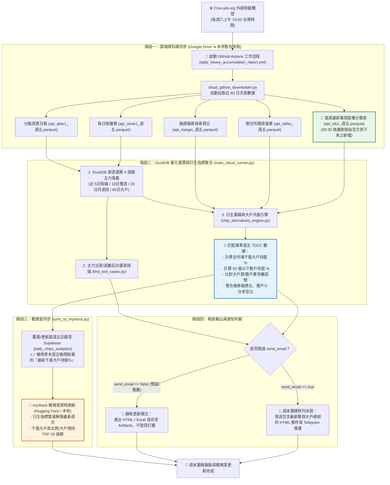

# 台股量化分析系統 — 週末集保大戶分析與戰情室同步流程說明書

本文件詳細記載 `stock_data_analysis`（主力重押量化分析專案）在每週六結合臺灣集中保管結算所（TDCC）最新股權分散表，進行全市場籌碼指標運算與 myStock 雲端戰情室同步之完整邏輯架構。

---

## 📌 目錄 (Table of Contents)
1. [業務背景與時間差痛點](#1-業務背景與時間差痛點)
2. [週末分析系統邏輯流程圖](#2-週末分析系統邏輯流程圖)
3. [五大核心處理階段細節剖析](#3-五大核心處理階段細節剖析)
4. [核心受影響資料指標對照表](#4-核心受影響資料指標對照表)
5. [Cron-job.org 外部排程設定卡片](#5-cron-joborg-外部排程設定卡片)
6. [執行驗證與常見問題排解](#6-執行驗證與常見問題排解)

---

## 1. 業務背景與時間差痛點

### ⚠️ 官方資料發布之時間差
- **集保官方公布時間**：臺灣集中保管結算所（TDCC）全市場股權分散表之業務基準日期為**每週五**，但官方系統固定於**每週六上午 08:30 ～ 09:00** 才會正式產生並更新至 Open Data 平台。
- **平日排程盲點**：
  - 每週五晚間（17:35 爬蟲、20:05 分析）執行時，官方尚未公布當週資料，因此週五晚間產出之分析報表與戰情室所載之集保大戶持股比例，本質上仍為**「上一週五」之舊數據**。
- **若週末不執行分析之後果**：
  - 即使爬蟲於週六 09:30 將最新一週集保 Parquet 檔案下載至 Google Drive，若無分析引擎介入運算，**整個週末（週六、週日）myStock 戰情室上的「千張大戶持股%」、「大戶週增減」與「散戶比例」將完全停滯於舊週次**，投資人無法於週末複盤時第一時間掌握主力大戶最新動作。

### 💡 解決方案：週六 10:00 專屬週末特刊與戰情室同步排程
- 於每週六上午 **10:00**（爬蟲抓取完畢後 30 分鐘）自動啟動 `stock_data_analysis`。
- 讀取最新週次集保檔案，重新計算全市場 2,000+ 檔個股之大戶持股比例與週增減，並**全面無條件覆蓋更新至 Supabase (myStock 戰情室)**。

---

## 2. 週末分析系統邏輯流程圖



---

## 3. 五大核心處理階段細節剖析

### 階段一：外部排程秒級發動 (Triggering Phase)
- **觸發來源**：Cron-job.org 於每週六 10:00:00 準時發送 HTTP POST 請求至 GitHub Actions API。
- **目標工作流**：`daily_heavy_accumulation_report.yml`。
- **參數彈性**：預設傳入 `{"send_email": "false"}`，實現**靜默背景同步**；若需派發 Email 報表，僅需設為 `"true"`。

### 階段二：雲端數據自動拉取與基準日錨定 (Data Ingestion)
- 調用 `cloud_gdrive_downloader.py`：
  - 自動下載 `api_absr1_*.parquet`（分點日報表）
  - 自動下載 `api_close1_*.parquet`（收盤價）
  - 自動下載 `api_margin_*.parquet`（信用交易）
  - 自動下載 `api_taifex_*.parquet`（期交所期貨）
  - **重點**：下載 09:30 剛抓取完畢的 `api_tdcc_當週五_當週五.parquet`。
- **交易日動態錨定**：分析引擎自動判斷檔案庫中最後一個有效交易日（即週五，例如 `2026-09-04`），所有運算以此基準日期進行對齊截斷。

### 階段三：DuckDB 量化運算與衍生籌碼共振 (Analysis Engine)
1. **主力連續吸籌四週期雷達**：
   - 5日短線爆發、10日波段吃貨、20日月線主力重押（川湖模型）、60日大戶底倉。
2. **反向主力出貨逃離雷達 (`find_exit_cases.py`)**：
   - 識別高檔主力倒貨、散戶接刀之弱勢標的。
3. **大戶共振與衍生指標計算 (`chip_derivatives_engine.py`)**：
   - `load_tdcc_data()` 自動比對小於等於基準週五之最新集保檔案。
   - 計算 **千張大戶持股比例 (`large_shareholder_pct`)** 與 **50張以下散戶持股比例 (`retail_shareholder_pct`)**。
   - 與前一週之數值進行比對，產出 **大戶持股週增減 (`diff_pct`)**。
   - 產出「大戶吸籌 + 融券激增」軋空雷達與「主力鎖碼 + 大戶增持」雙重共振清單。

### 階段四：雲端戰情室寫入 (myStock & Supabase Sync)
- 呼叫 `sync_to_mystock.py`：
  - `purge_date_from_supabase(trade_date)`：清除該交易日舊有暫存記錄，確保資料純淨度。
  - `upsert_to_supabase(payloads)`：批次寫入全市場最新籌碼指標寬表至 Supabase `daily_chips_analytics`。
- **myStock 即時呈現**：
  - 使用者在手機或瀏覽器開啟 `myStock 戰情室`，無需手動刷新快取，即可查閱最新一週的千張大戶排行與背離雷達。

### 階段五：報表產出與通知判斷 (Reporting & Notification)
- 根據 `send_email` 參數進行分支：
  - **`send_email: false`**（推薦模式）：產出 HTML 與 Excel 檔並自動保存至 GitHub Artifacts（保存 14 天），靜默結束任務，不打擾使用者信箱。
  - **`send_email: true`**：自動透過 SMTP 與 Telegram Bot 派發「週末主力籌碼總盤點特刊」郵件與即時快訊。

---

## 4. 核心受影響資料指標對照表

| 資料指標名稱 | 欄位代碼 | 週五晚間狀態 | 週六 10:00 週末同步後狀態 |
| :--- | :--- | :--- | :--- |
| **千張大戶持股比例** | `large_shareholder_pct` | 停留在前一週五舊數據 | **更新為當週五最新大戶持股%** |
| **千張大戶持股週增減** | `large_shareholder_diff_1w` | 缺失或計算前週數值 | **即時計算當週大戶增持/減持幅度 (%)** |
| **50張以下散戶持股比** | `retail_shareholder_pct` | 停留在前一週五舊數據 | **更新為當週五最新散戶籌碼分散度 (%)** |
| **籌碼集中度背離雷達** | `divergence_tag` | 未能反映當週籌碼變化 | **成功辨識「大戶狂買+散戶大賣」之鎖碼股** |
| **myStock 戰情室大戶卡片** | `大戶增持 TOP 20` | 顯示上週排行 | **更新為本週最新大戶集中度激增榜** |

---

## 5. Cron-job.org 外部排程設定卡片

### 任務卡片：週末集保大戶分析與戰情室同步 (任務 ⑤)
- **Title (名稱)**：
  ```text
  台股週末主力分析與戰情室同步 (含最新集保大戶)
  ```
- **URL (請求網址)**：
  ```text
  https://api.github.com/repos/ark945/stock_data_analysis/actions/workflows/daily_heavy_accumulation_report.yml/dispatches
  ```
- **Execution Schedule (排程時間)**：
  - 時區：`Asia/Taipei` (台灣時區)
  - 時間：**每週六上午 10:00**（09:30 集保爬蟲抓完後 30 分鐘）
- **Request Method**：`POST`
- **Request Headers (填入 4 條標頭)**：
  | Header Key | Header Value |
  | :--- | :--- |
  | `Accept` | `application/vnd.github+json` |
  | `Authorization` | `Bearer 您的GitHub_PAT_Token` *(需具備 repo 或 workflow 權限)* |
  | `X-GitHub-Api-Version` | `2022-11-28` |
  | `User-Agent` | `CronJob-Trigger-Bot` |
- **Request Body (JSON)**：
  ```json
  {
    "ref": "main",
    "inputs": {
      "target_date": "",
      "send_email": "false"
    }
  }
  ```
  *(💡 說明：`send_email` 設為 `"false"` 採靜默更新；若週六想收到 Email 週末特刊，改為 `"true"` 即可)*

---

## 6. 執行驗證與常見問題排解

### Q1: 在 Cron-job.org 點擊「Test run」測試，回傳 204 是正常的嗎？
> **解答**：**完全正常，這是 100% 成功的標誌**！GitHub REST API 接收到工作流程派發指令後，固定回傳 `HTTP 204 No Content`。此時前往 GitHub 專案之 `Actions` 頁籤即可看到任務已即時啟動。

### Q2: 週六執行會不會把週五的分點資料洗掉？
> **解答**：不會。分析引擎運算時，所有的分點買賣金額、川湖模型主力均價、站上 VWAP 等資料都是依據週五已封盤的資料進行運算，週六的執行僅是**把最新出爐的集保大戶數據與週五分點合併**，讓戰情室指標更加完整。

### Q3: 若官方集保資料在週六 09:30 延遲釋出怎麼辦？
> **解答**：`tdcc_shareholding_crawler.py` 與 `reconcile_lightweight_crawlers.py` 具備日期防呆校驗；若官方尚未發布，不會產生錯誤假資料。同時系統在**下週一開盤前的前置檢查**會再次巡檢，若發現上週五集保數據缺失，會自動進行二次補齊，具備多重防護機制。
